# Discovered Vulnerabilities

## 1. Reentrancy attack

Donation.retreive() sends ETH via .call() BEFORE calling decUserBalance().

A malicious contract re-enters retreive() from its receive() hook and drains victim deposits repeatedly before the balance is ever zeroed.

Effectively this means that an attacker can steal money from other people's donation using this method.

Logs of the exploit script:

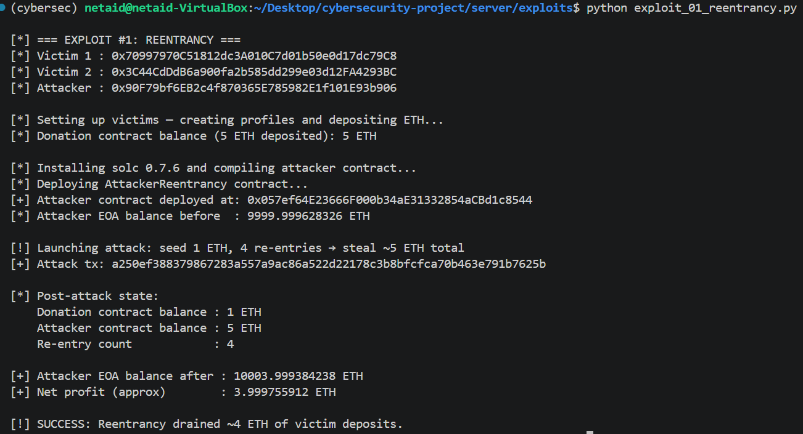

Account balances visible in Metamask after exploit script:

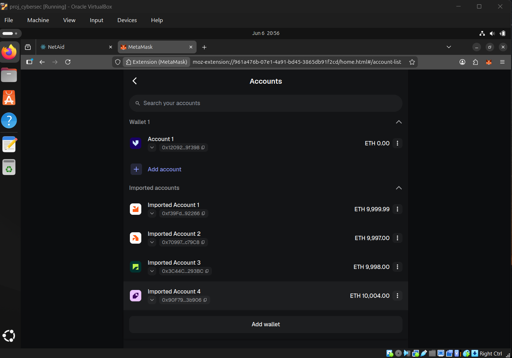

## 2. Ghost Profile via Missing Existence Guard on editProfile()

Root cause: UserProfile.editProfile() has no check that a profile was previously created via createNewProfile(). Any address can call editProfile() directly, bypassing createNewProfile() entirely.

Logs of the exploit script:

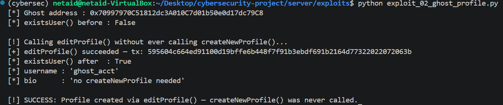

Account in application UI:

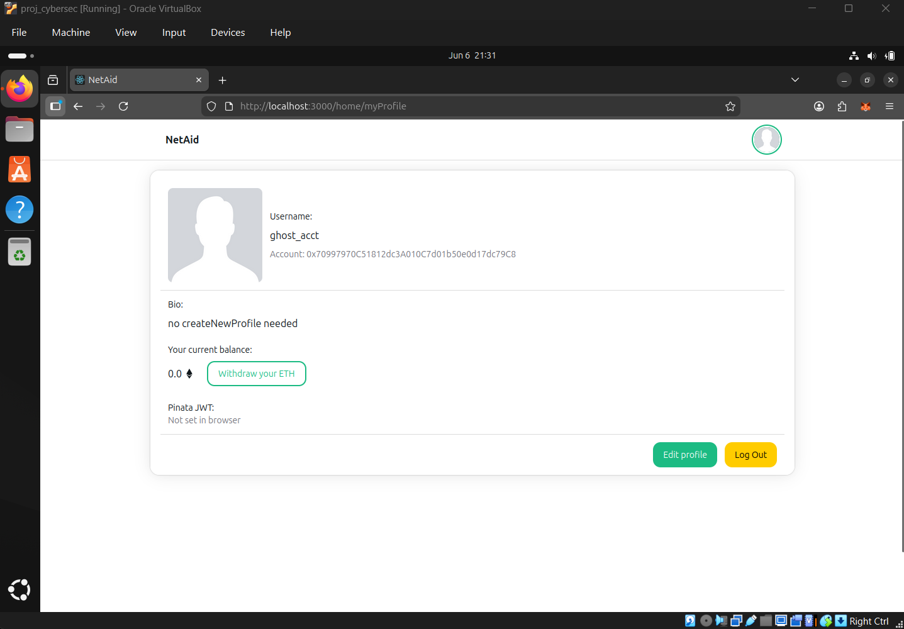

## 3. Missing access control allows stealing money

No access control - set to donationContractAddress in UserProfile contract to an EOA address

UserProfile.setDonationContract() sets donationContractAddress to msg.sender with NO owner check, no one-time guard, and no event. Any externally owned account can call it at any time.

Donation.setContractInUserProfile() calls UserProfile.setDonationContract() from inside the Donation contract, so msg.sender = Donation address, essentially resetting donationContractAddress to the real Donation contract. This can be called by anyone at any time, and there's no event emitted, so it's not easily detectable.

Ideea:
1. Attacker calls UserProfile.setDonationContract() to set donationContractAddress = attacker's EOA address.
2. Victims call Donation.retreive() to withdraw their ETH, but the auth check in decUserBalance() fails because donationContractAddress is not the real Donation contract. Victims' ETH is permanently locked in the Donation contract with no way to retreive().
3. Attacker calls UserProfile.decUserBalance() directly to zero out victims' credited balance, causing permanent accounting corruption in the UserProfile contract. Even if the donationContractAddress is restored later, victims can never retreive() their locked ETH because their balance is now zero.
4. Attacker can call Donation.setContractInUserProfile() to restore donationContractAddress to the real Donation contract, then call retreive() to withdraw any ETH they inflated in their UserProfile balance, draining the Donation contract.

Logs of the exploit script:

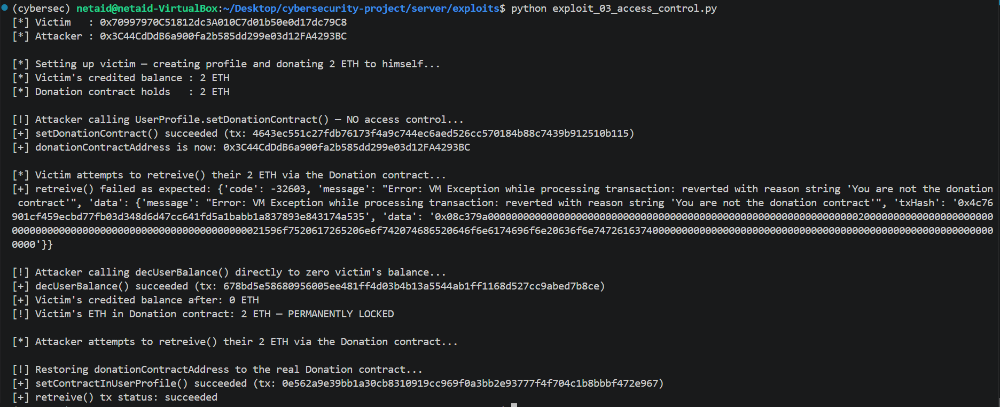

Balances in Metamask UI after attack:

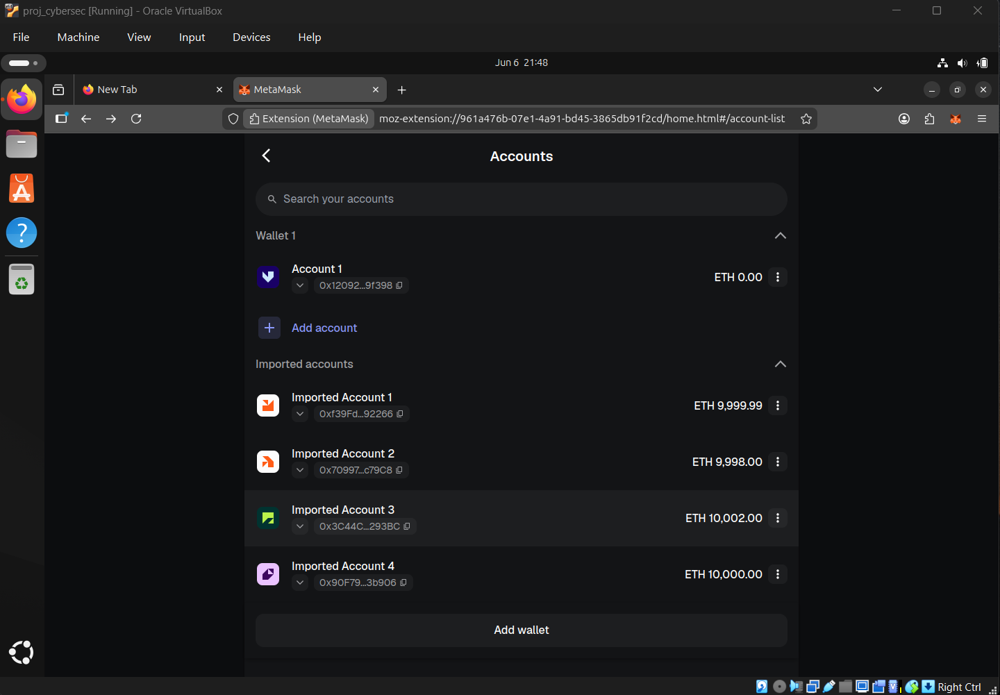

## 3.1 Missing access control blocks application functionality

No access control - set to donationContractAddress in UserProfile contract to an EOA address

UserProfile.setDonationContract() sets donationContractAddress to msg.sender with NO owner check, no one-time guard, and no event. Any externally owned account can call it at any time.

Donation.setContractInUserProfile() calls UserProfile.setDonationContract() from inside the Donation contract, so msg.sender = Donation address, essentially resetting donationContractAddress to the real Donation contract. This can be called by anyone at any time, and there's no event emitted, so it's not easily detectable.

Ideea:
1. Attacker calls UserProfile.setDonationContract() to set donationContractAddress = attacker's EOA address.
2. Then, when any user tries to make a donation or retreive() their ETH, the checks fail because donationContractAddress is not the real Donation contract and the functionality is blocked.

Logs of the exploit script:

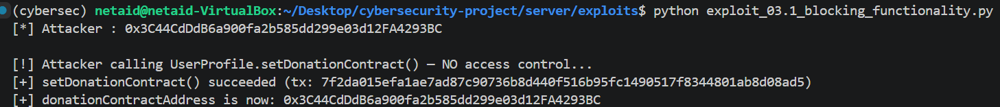

Error logs in browser when attempting to make a donation:

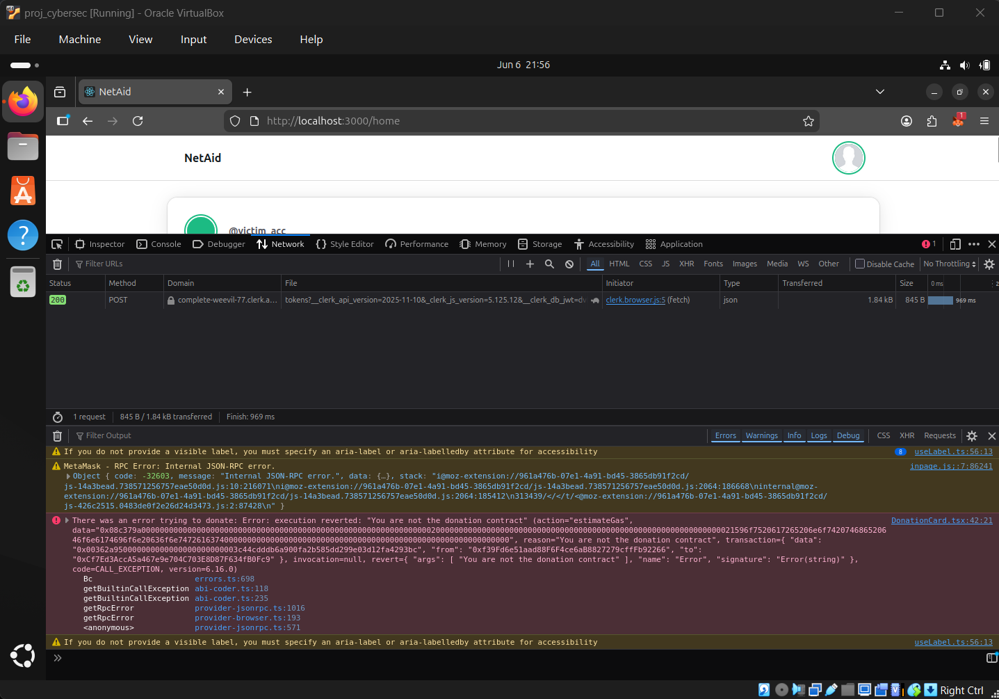

## 4. Integer underflow

Integer Underflow in UserProfile.decUserBalance() (Solidity 0.7.6)

Root cause: The contracts are compiled with Solidity ^0.7.6, which has NO built-in arithmetic overflow/underflow protection (that was introduced inSolidity 0.8.0). In UserProfile.decUserBalance():

```solidity
    profiles[user].balance -= amount;
```

If `amount > profiles[user].balance`, the subtraction wraps around to an astronomically large uint256 value (2^256 - delta). There is no `require(profiles[user].balance >= amount)` guard.

Logs of the exploit script:

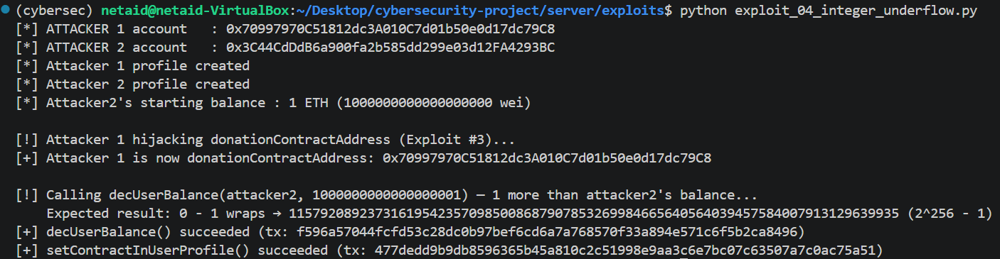

Attacker2 in-app account balance:

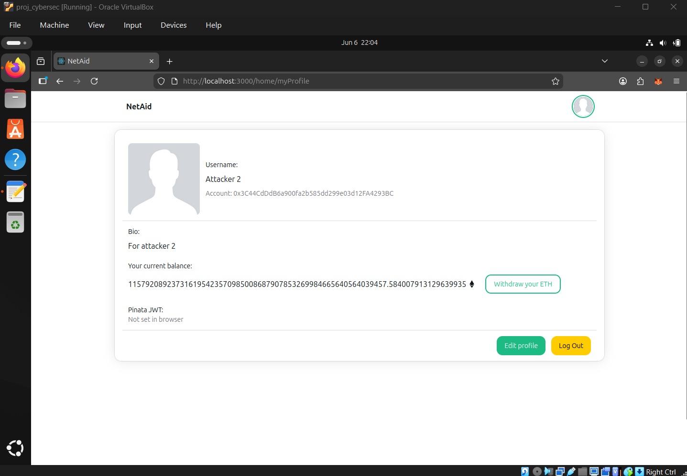

## 5. Gas Griefing via missing input validation

Root cause: Post.createPost(), Comment.createComment(), andUserProfile.createNewProfile() accept completely arbitrary-length stringswith no on-chain size guard. The only check is:

```solidity
    modifier notEmpty(string memory text, string memory photoCid) {
        require(bytes(text).length > 0 || bytes(photoCid).length > 0, ...);
        _;
    }
```

Every post/comment is pushed into a storage array (content_list) that is loaded in full by getAllContent() — which is called by getAllPosts(), which is called by the frontend on every page load.

Logs of the exploit script:

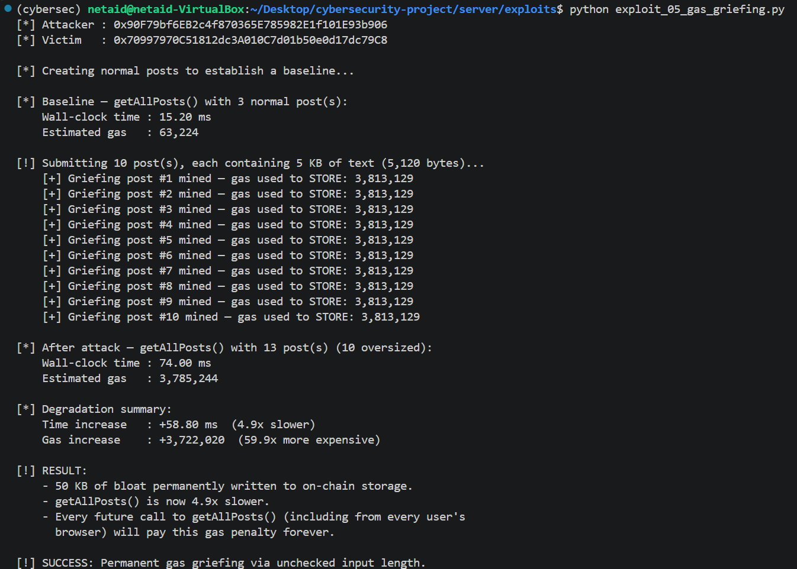

## 6. Blind SSRF

Root cause: CommentBox.tsx renders every comment's text directly as the src attribute of a hidden iframe with no sanitization:

```html
    <iframe title='comment-text' src={comment.text} className="hidden" />
```

Comment text is stored on-chain and is immutable.  Even though the iframe is visually hidden (className="hidden"), the BROWSER still issues a full HTTP GET request to whatever URL is stored in comment.text the moment the component mounts.

Requests made seen in developer tools:

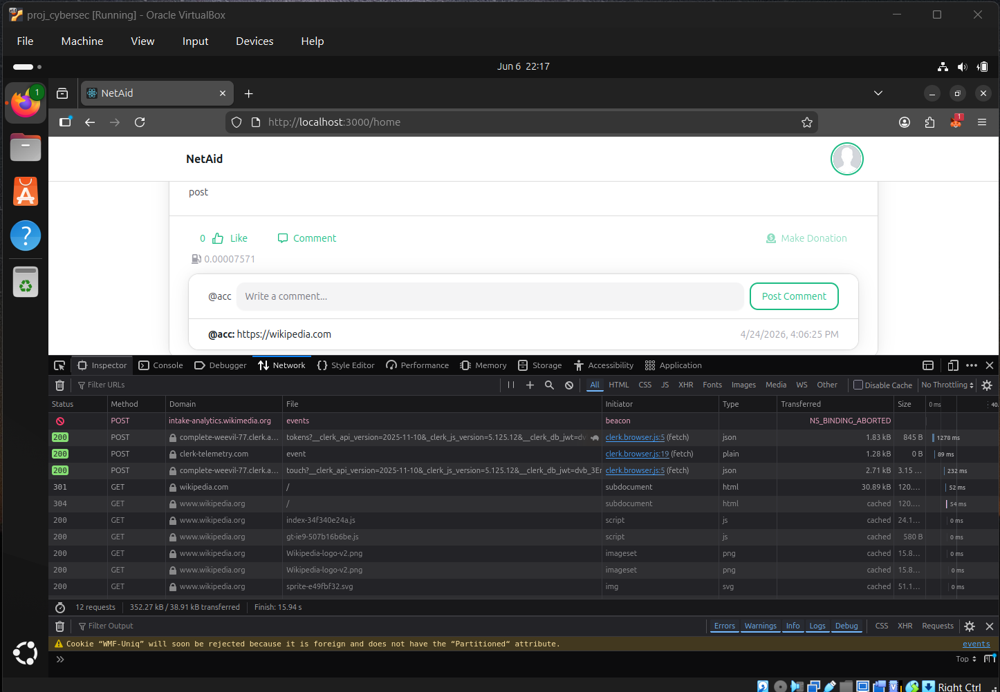

## 7. ETH forever blocked via Unchecked Return Value of low-level .call() in Donation.retreive()

Root cause: Donation.retreive() transfers ETH via a low-level .call() and NEVER checks its boolean return value:

```solidity
    payable(msg.sender).call{value: user.balance}("");   // return value ignored
    UserProfileContract.decUserBalance(msg.sender, user.balance);
```

If the recipient is a contract whose receive() reverts, the .call() silently returns (false, ...) but execution continues. decUserBalance() is still called, zeroing the user's credited balance in UserProfile. The ETH remains permanently locked inside the Donation contract with no recovery path.

Logs of the exploit script:

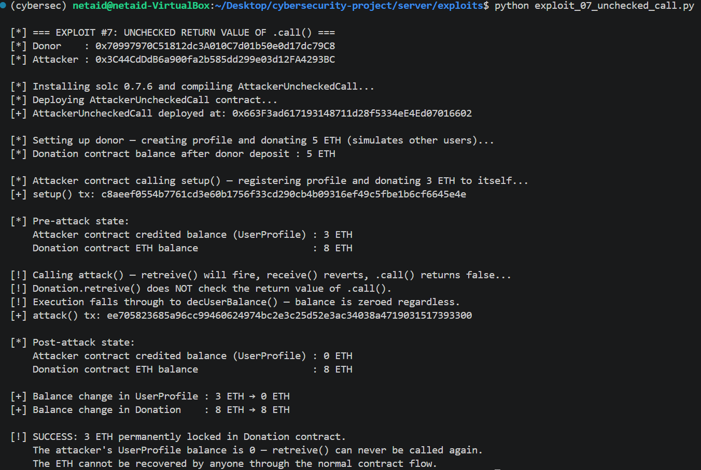
